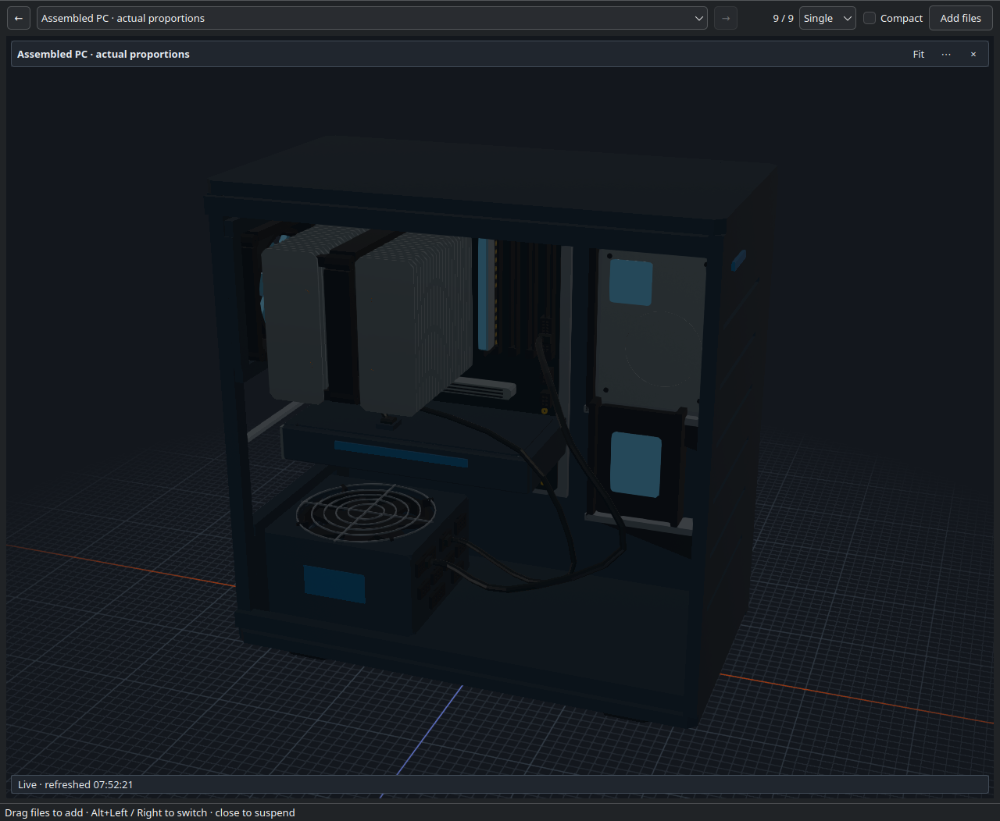
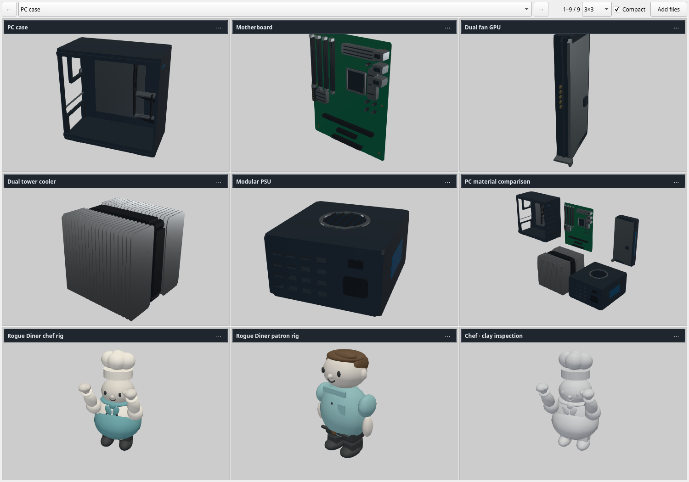
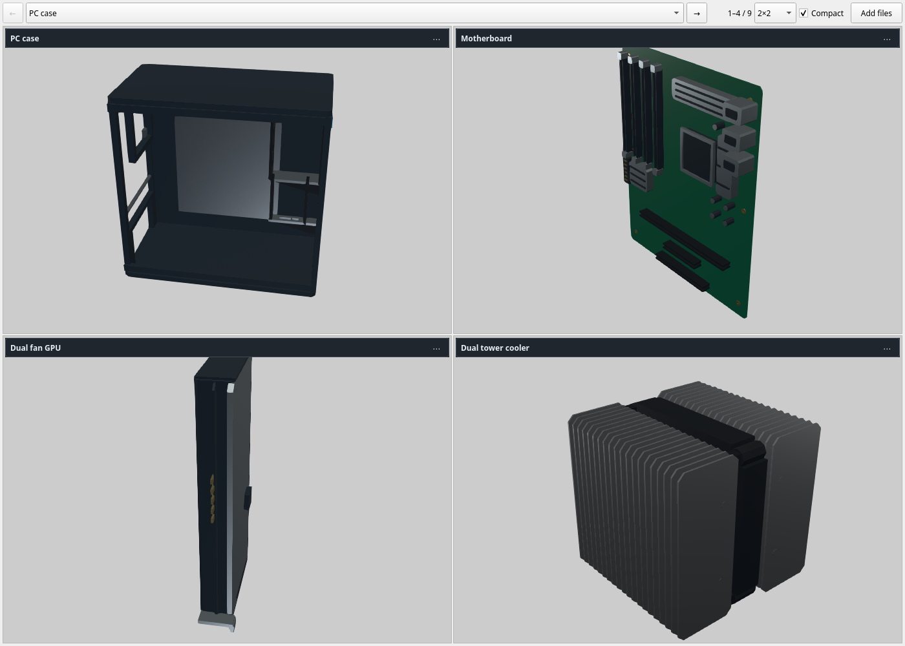

# Asset Preview

Live asset viewer for AI agent workflows. Keep the window open; agents register
images, videos, 3D models and baked materials through the CLI or
[Codex skill](skills/asset-preview/SKILL.md). Previews refresh when files change.
Registration preserves window placement and selection.

## Screenshots

Single view: assembled PC from a three-quarter angle, showing components and cabling.



Compact 3×3: PC components, character models and clay inspection.



Compact 2×2: component inspection.



## Downloads

[Release 0.0.1](https://github.com/RaresKeY/asset-preview/releases/tag/0.0.1)
provides a standalone Linux x86_64 executable. Download the `.run` file, make it
executable with `chmod +x`, and run it. Requires glibc 2.39+ and host
X11/XWayland/OpenGL drivers.

Private container: `ghcr.io/rareskey/asset-preview:0.0.1`.
See [distribution notes](packaging/release-notes.md) for runtime requirements,
container mounts and dependency sources. The release uses LGPL FFmpeg;
[dependency notices](THIRD_PARTY_NOTICES.md) and corresponding sources accompany
the downloads. `asset-preview licenses` prints the notices.

## Build and install

Requires Linux, CMake 3.22+, a C++20 compiler, Python 3, Qt 6.4+
Widgets/Network/OpenGL, F3D 3.5+ with native and Assimp readers, and libmpv
headers/library (`pkg-config mpv`). Dependencies must already be installed.

```sh
./tools/build.sh
python tools/install.py
./bin/asset-preview
```

The installer adds a desktop entry, fish command/completion and the Codex skill.
Use `./bin/asset-preview` from other shells, or launch through `./play.sh`.
Installation points into this checkout; reinstall integration after moving it.

The supported display path is X11/XWayland (`QT_QPA_PLATFORM=xcb`). Native
Wayland 3D embedding is unsupported. Explicit platform overrides are respected.

## Commands

Examples use the installed fish command; otherwise use `./bin/asset-preview`.

```sh
asset-preview                                      # open the window
asset-preview add /path/to/chair.glb --id chair --label "Chair"
asset-preview add /path/to/texture.png --id texture
asset-preview add /path/to/turntable.mp4 --id turntable
asset-preview layout grid --size 3 --compact        # sizes: 2, 3, 4
asset-preview select chair
asset-preview status --json
asset-preview remove chair                         # preserves the file
```

Reusing an ID updates its registration. Files can be registered before they exist.
`start` starts the service without raising the window; `hide` suspends all views;
`stop` exits the service. Registrations and layout persist across restarts.

## Controls

| Preview | Controls |
|---|---|
| Image | Wheel zoom, drag pan, fit, pixel filtering, checker/dark/light background |
| Model | Drag orbit, right/middle/Shift drag pan, wheel zoom, double-click fit |
| Video | Space/double-click pause, Shift+Left/Right seek, Home restart, M mute |

The **⋯** menu provides display options, including clay/textured shading,
lighting, grid, axes, projection and Y/Z-up. Videos loop and start muted.
Left/Right navigates previews or pages, matching the toolbar arrows;
Alt+Left/Right also works. Compact mode reduces spacing and
hides steady live status; waiting, building and errors remain visible.
Only the current page is loaded. Minimizing or closing releases views and stops
their generators; closing leaves the service running.

## Source-triggered generation

If the agent already builds the asset, register its output with `add`.
To rebuild on source saves, attach a finite command:

```sh
asset-preview add /absolute/project/exports/chair.glb --id chair \
  --watch /absolute/project/source/chair.json \
  --cwd /absolute/project \
  --exec /absolute/project/tools/build-chair.sh
```

Put `--exec` last. Arguments run directly without shell expansion. Repeat
`--watch` for input files; exclude generated outputs. Commands run only while
the view is visible, with serialized runs and a default 120-second timeout
(`--timeout` accepts 1–3600). Publish outputs atomically. Failed builds retain
the last good preview and show the error.

## Baked materials

```sh
asset-preview material /path/to/albedo.png --id finish \
  --normal /path/to/normal.png --orm /path/to/orm.png --shape sphere
```

Shapes: sphere, cube, plane. Albedo is sRGB; normal and ORM are linear.
ORM channels are occlusion, roughness and metallic in R/G/B. Engine shaders and
material graphs require an exported model, baked maps or an engine capture PNG.

## Limits and verification

Image/model/material files are limited to 256 MiB. Images decode to at most
4096 pixels per edge. Videos stream from local files. Large model imports can
pause the UI; imported 3D animation is static. Format support depends on the
installed Qt image plugins, F3D readers and mpv codecs. Hardware video decoding
is requested with software fallback. Static and paused views have no idle render loop.

```sh
./tools/test.sh functional
./tools/test.sh gpu
```

GPU checks use headless Gamescope; video fixtures require FFmpeg.

[Agent workflow](docs/agent-flow.md) · [Protocol and settings](docs/protocol.md) ·
[Specs](specs/_readme.md) · [Rendering](vendored/rendering.md) ·
[Verification evidence](evidence/verification.md)

## License

[MIT](LICENSE) for Asset Preview. Dependencies retain their own licenses; see
[third-party notices](THIRD_PARTY_NOTICES.md).
